# Отчёт по лабораторной работе №1
## Тема: Цветовые модели и передискретизация изображений

**Исходное изображение:** `./input_demo.png`  
**Результаты обработки:** `./output/images/`, `./output/comparisons/`  
**Скрипт:** `./lab1.py`

---

## Цель работы
Изучить представление полноцветного изображения в цветовых моделях RGB и HSI и реализовать передискретизацию изображения без использования библиотечных функций изменения размера.

---

## Исходные данные
В качестве исходного использовано полноцветное трёхканальное изображение `input_demo.png`.

### Исходное изображение
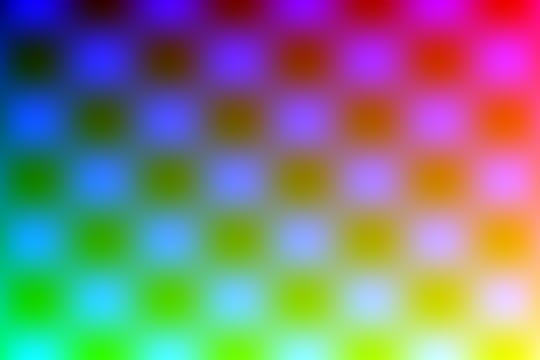

---

## 1. Цветовые модели

### 1.1. Выделение компонент R, G, B
**Метод:** из RGB-изображения отдельно сохраняются каналы R, G и B как полутоновые изображения.

Формально:

- `R(x, y) = img[x, y, 0]`
- `G(x, y) = img[x, y, 1]`
- `B(x, y) = img[x, y, 2]`

**Результаты:**

Компонента R  
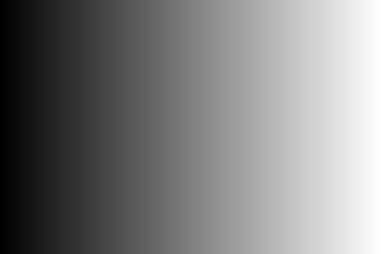

Компонента G  

Компонента B  
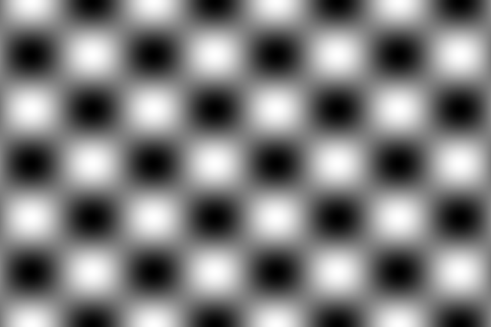

Сравнение с исходным:  
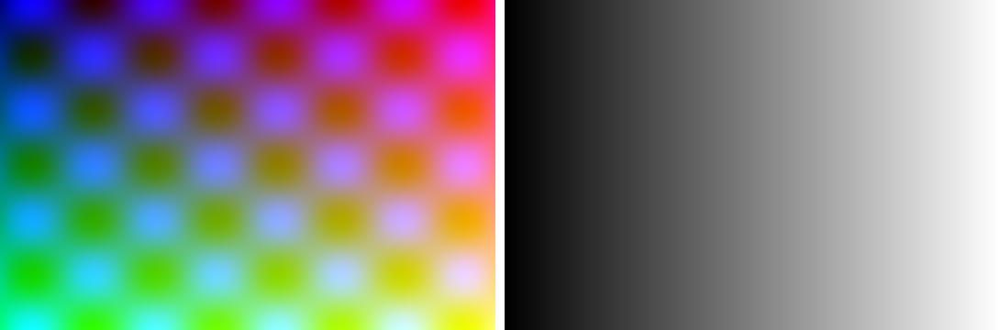

---

### 1.2. Преобразование RGB → HSI и выделение яркостной компоненты
**Метод:** изображение переводится в HSI, далее сохраняется компонент яркости `I`.

Формула яркости:

`I = (R + G + B) / 3`

где `R, G, B` нормированы в диапазон `[0, 1]`.

**Результат:**

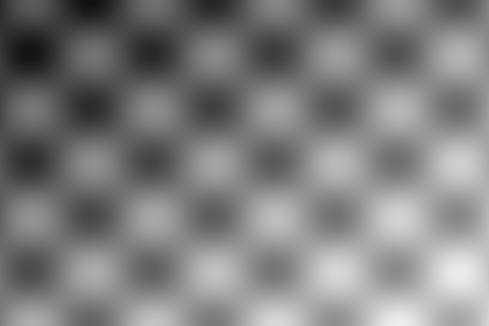

Сравнение с исходным:  
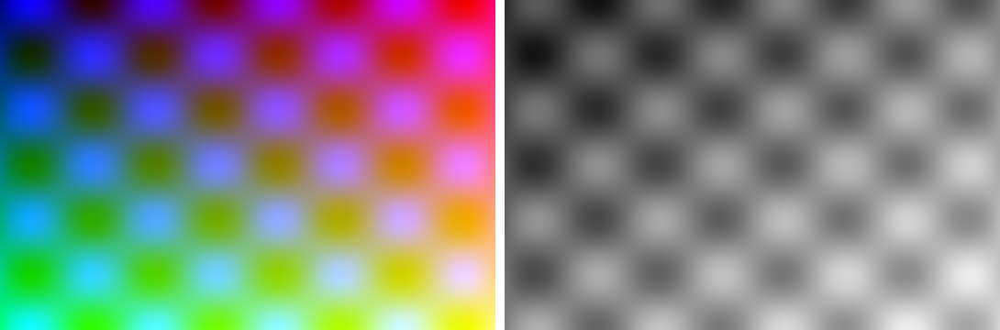

---

### 1.3. Инверсия яркостной компоненты в исходном изображении
**Метод:** после перехода в HSI яркость инвертируется:

`I' = 1 - I`

После этого выполняется обратное преобразование HSI → RGB.

**Результат:**

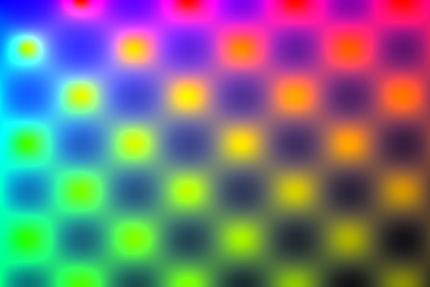

Сравнение с исходным:  
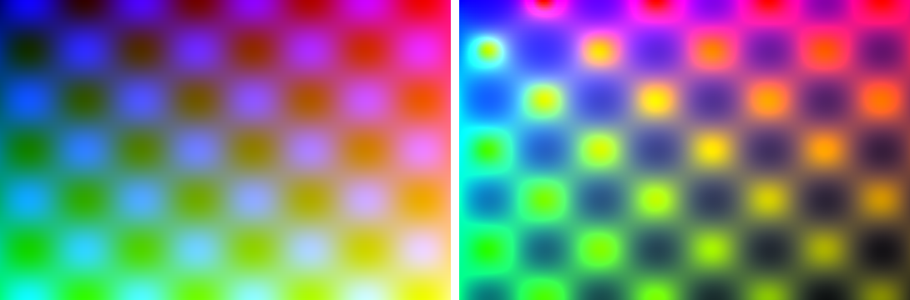

---

## 2. Передискретизация изображений

### Общий принцип
Для изменения размеров реализована ручная билинейная интерполяция (без библиотечного resize).

Для точки с дробными координатами `(x, y)`:

`P(x, y) = (1-wy) * ((1-wx) * P(x0, y0) + wx * P(x1, y0)) + wy * ((1-wx) * P(x0, y1) + wx * P(x1, y1))`

где:

- `x0 = floor(x), x1 = x0 + 1`
- `y0 = floor(y), y1 = y0 + 1`
- `wx, wy` — дробные части координат.

В вашем скрипте по умолчанию:

- `M = 3` — растяжение в 3 раза;
- `N = 2` — сжатие в 2 раза;
- `K = M / N = 1.5`.

---

### 2.1. Растяжение изображения в M раз
**Метод:** билинейная интерполяция при `M = 3`.

**Результат:**

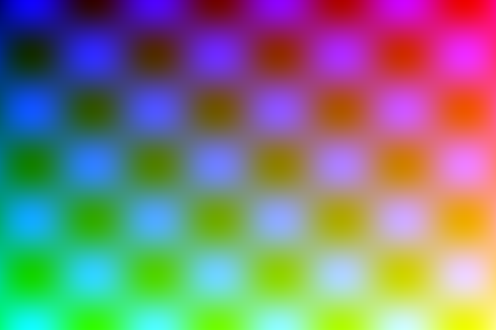

Сравнение:  
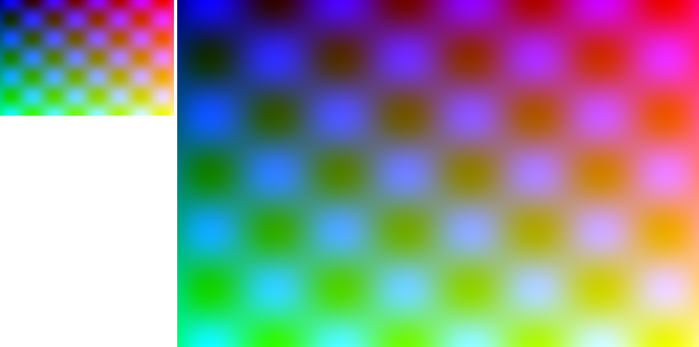

---

### 2.2. Сжатие изображения в N раз
**Метод:** децимация `image[::N, ::N]` при `N = 2`.

**Результат:**

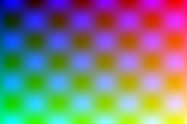

Сравнение:  
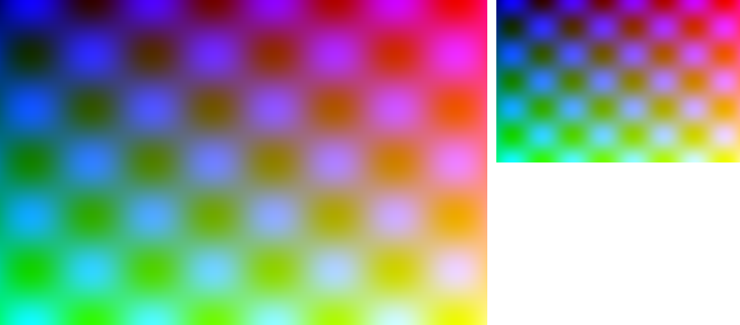

---

### 2.3. Передискретизация в коэффициент K = M/N в два прохода
**Метод:**
1. растяжение в `M = 3`,
2. сжатие результата в `N = 2`.

Итоговый коэффициент:

`K = 3 / 2 = 1.5`

**Результат:**

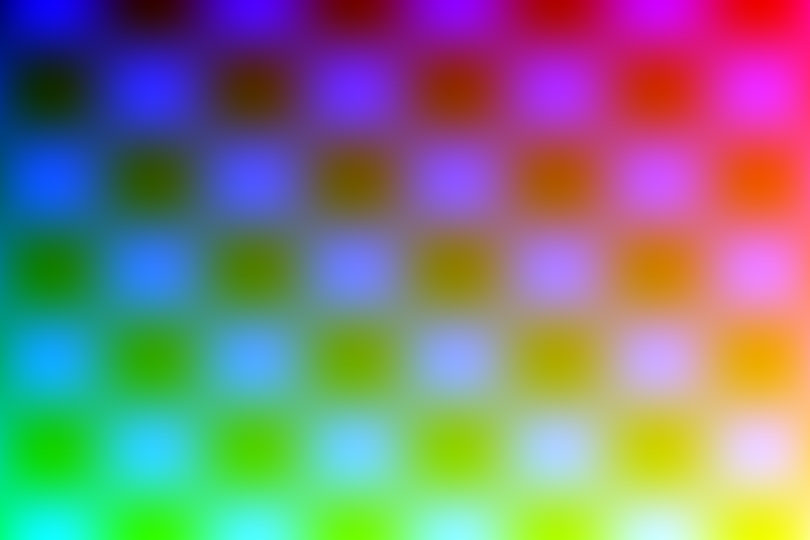

Сравнение:  

---

### 2.4. Передискретизация в коэффициент K за один проход
**Метод:** прямое билинейное масштабирование с коэффициентом `K = 1.5` за один этап.

**Результат:**

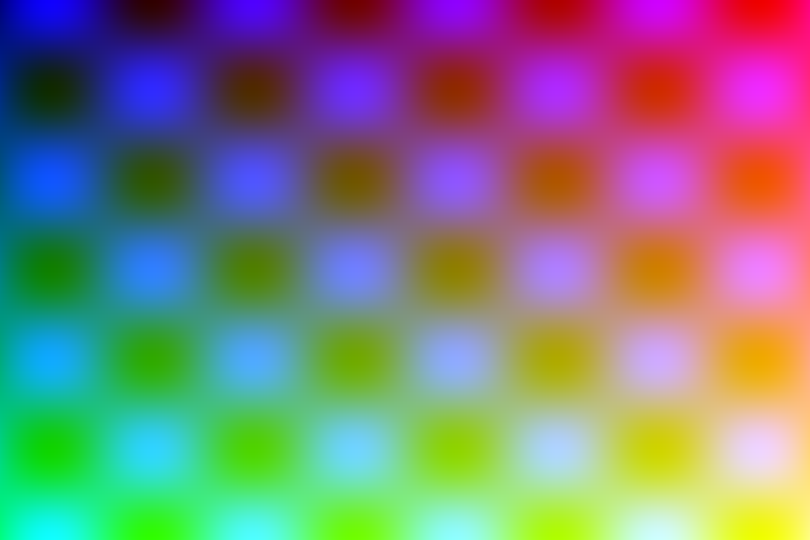

Сравнение:  
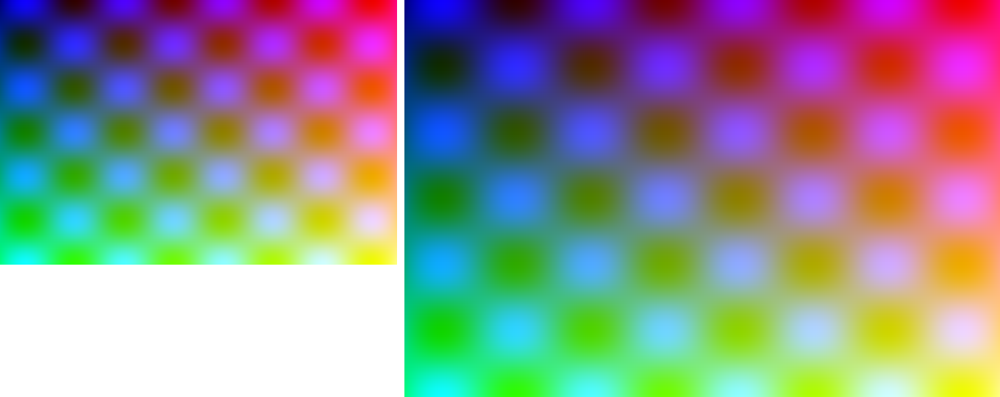

---

## Сравнение результатов
- Разделение на каналы R/G/B показывает вклад каждого цветового компонента.
- Компонента `I` в HSI отделяет яркость от цветового тона и насыщенности.
- Инверсия `I` изменяет светлоту сцены при сохранении цветовой структуры.
- Растяжение увеличивает размер изображения, но может усиливать сглаживание.
- Сжатие уменьшает размер и теряет часть мелких деталей.
- Один и два прохода при одинаковом `K` могут давать слегка различающийся визуальный результат.

---

## Вывод
В лабораторной работе реализованы:

- выделение компонент `R`, `G`, `B`;
- преобразование RGB → HSI и выделение яркости `I`;
- инверсия яркостной компоненты;
- передискретизация (растяжение, сжатие, один/два прохода) без библиотечного resize.

Практическая часть показала влияние цветовой модели и способа масштабирования на итоговое качество изображения.

