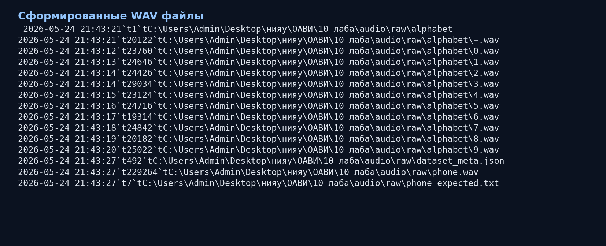
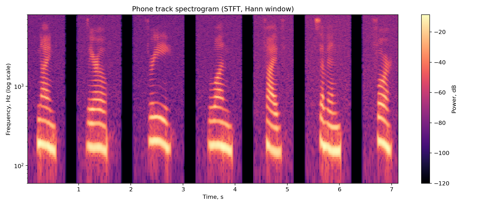
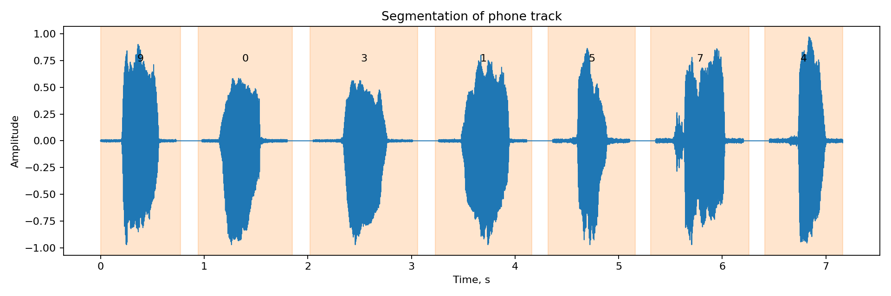
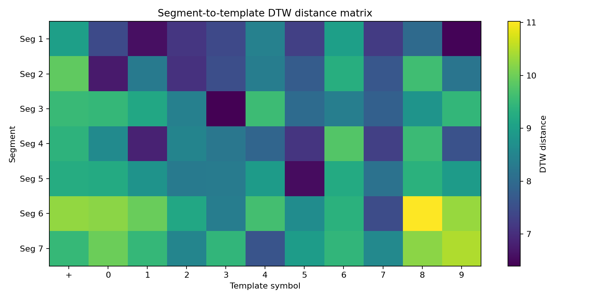
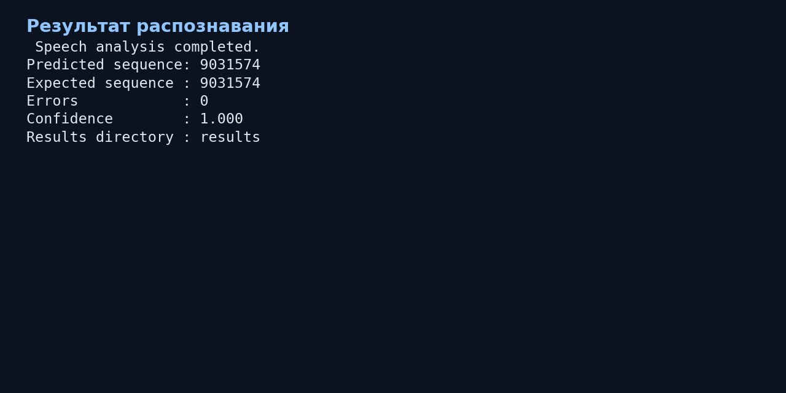

# Лабораторная работа №10: Обработка голоса (вариант 3)

**Дисциплина:** ОАВИ  
**Тема:** Анализатор речи  
**Дата формирования отчёта:** 2026-05-24 21:44

## 1. Цель работы
Реализовать пайплайн распознавания словарных единиц (0..9 и «плюс») в записи телефонного номера:
- построить спектрограмму записи на основе STFT с окном Ханна;
- сегментировать дорожку на отдельные слова;
- сопоставить сегменты с эталонами;
- получить цепочку символов, число ошибок и оценку достоверности.

## 2. Использованное ПО
- `ffmpeg` (генерация/подготовка аудио);
- `Python 3.11`;
- библиотеки: `numpy`, `scipy`, `matplotlib`.

## 3. Выполнение работы
1. Подготовлен алфавит из 11 эталонов (`0..9` и `+`) и запись телефонного номера.
   Для автоматического прогона в этом отчёте использован синтезированный голос (`ffmpeg flite`);
   для сдачи с собственным голосом используется `scripts/record_from_microphone.ps1`.
2. Для телефонной дорожки рассчитана спектрограмма STFT (окно Ханна, логарифмическая шкала частот).
3. Реализована процедура сегментации по кратковременной энергии.
4. Реализовано сопоставление сегментов с эталонами: MFCC + DTW.
5. Получен распознанный номер, рассчитаны ошибки и достоверность.

## 4. Результаты
- Частота дискретизации: **16000 Гц**
- Количество найденных сегментов: **7**
- Ожидаемая последовательность: **9031574**
- Распознанная последовательность: **9031574**
- Число ошибок (редакционное расстояние): **0**
- Оценка достоверности: **1.000**

## 5. Скриншоты проделанной работы
### 5.1 Подготовка данных

### 5.2 Спектрограмма записи телефонного номера

### 5.3 Сегментация телефонной дорожки

### 5.4 Матрица расстояний DTW

### 5.5 Итоги распознавания (консоль)

## 6. Вывод
Построен и протестирован полный анализатор речи для варианта 3: спектральный анализ, сегментация и распознавание по словарю. Получены количественные метрики качества (ошибки и достоверность), результаты визуализированы и сохранены.
