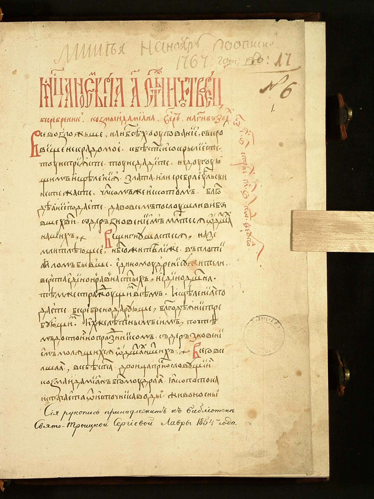
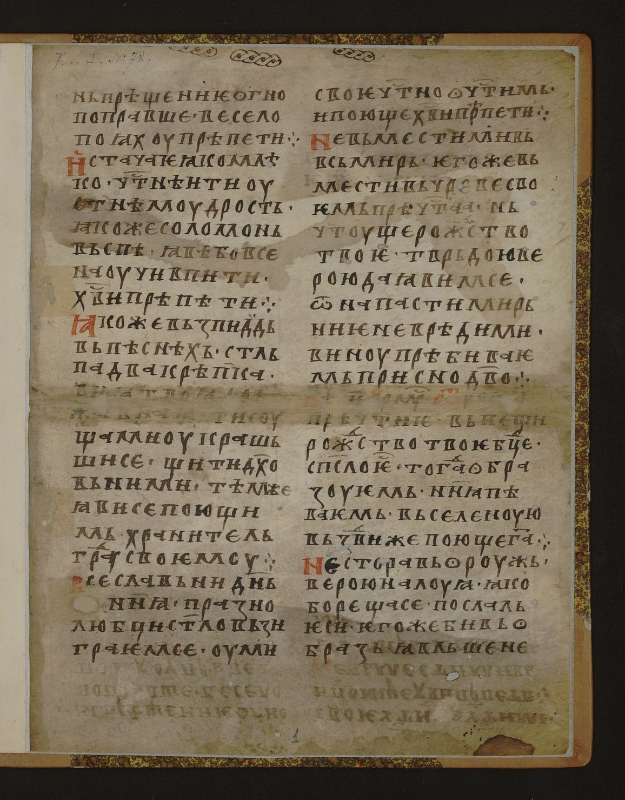
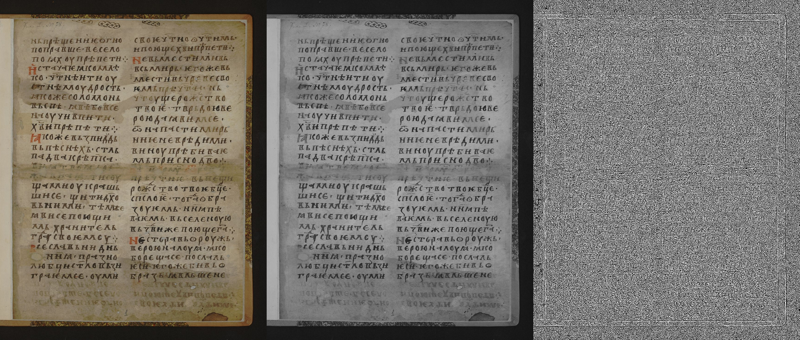
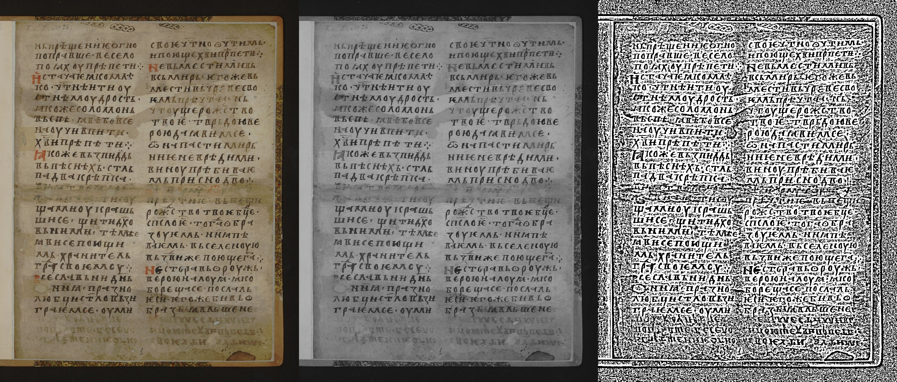
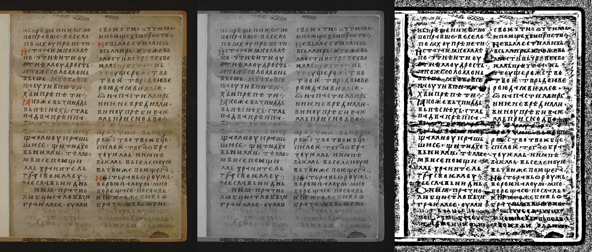

# ????? ?? ???????????? ?????? ?2
## ?????????????? ? ??????????? ????????? ??????????? (??????? 3)

**???????? ???????????:** `./input/*.png`  
**?????????? ?????????:** `./output/`, `./output_w15/`, `./output_w50/`  
**??????:** `./lab2_variant3.py`

---

## ???? ??????
??????????? ?????????????? ????????????? ??????????? ? ?????????? ??????????? ? ?????????? ????????? ?????????? ????.

---

## ???????????? ??????

### 1. ??????? RGB ? ??????????? ???????????
??????? ??????? ??????? ??????????? ?? ???????:

`Y = 0.299R + 0.587G + 0.114B`

?????????: `*_gray.bmp`.

### 2. ?????????? ??????????? (??????? 3)
??? ??????? ??????? ???????????? ????????? ?????:

`T(x,y) = mean_window(x,y) - offset`

`B(x,y) = 255, ???? I(x,y) > T(x,y), ????? 0`

????????? ????????????:
- `offset = 0`;
- ??????? ????: `3x3`, `15x15`, `50x50`.

? ???? ???????????? ???????????? ??????????? ??? ???????? ??????? ???????? ?? ????.

---

## ???????? ??????
??????? ?????: `01.png ... 07.png` ? ???????? `./input/`.

---

## ????????? ??????????? ??? ?????? ?????
???? ??? ??????? ??????? ????????: ???????? ???????????, ?????? ??? ???? `3x3`, ?????? ??? ???? `15x15`, ?????? ??? ???? `50x50`.

### ?????? 01
**???????? ???????????**  

**???? 3x3 (`./output`)**  

**???? 15x15 (`./output_w15`)**  

**???? 50x50 (`./output_w50`)**  

### ?????? 02
**???????? ???????????**  

**???? 3x3 (`./output`)**  

**???? 15x15 (`./output_w15`)**  

**???? 50x50 (`./output_w50`)**  

### ?????? 03
**???????? ???????????**  

**???? 3x3 (`./output`)**  

**???? 15x15 (`./output_w15`)**  

**???? 50x50 (`./output_w50`)**  

### ?????? 04
**???????? ???????????**  

**???? 3x3 (`./output`)**  

**???? 15x15 (`./output_w15`)**  

**???? 50x50 (`./output_w50`)**  

### ?????? 05
**???????? ???????????**  

**???? 3x3 (`./output`)**  

**???? 15x15 (`./output_w15`)**  

**???? 50x50 (`./output_w50`)**  

### ?????? 06
**???????? ???????????**  

**???? 3x3 (`./output`)**  

**???? 15x15 (`./output_w15`)**  

**???? 50x50 (`./output_w50`)**  

### ?????? 07
**???????? ???????????**  

**???? 3x3 (`./output`)**  

**???? 15x15 (`./output_w15`)**  

**???? 50x50 (`./output_w50`)**  

---

## ?????
- ??? ?????????? ???? ????????? ????? ?????????? ????? ?????????? ?? ???????????.
- ???? `15x15` ?????? ???? ?????????? ????? ????????? ?????????? ? ??????????? ?????? ?????.
- ???? `50x50` ?????? ??????????? ????? ??????????: ?????? ?????? ????? ????????, ?? ??????? ????????? ?????????? ??????????.
- ??? ??????????? ? ????????????? ????????????? ?????? ??????? ???? ??????????? ?????? ?? ???????? ???????????.

