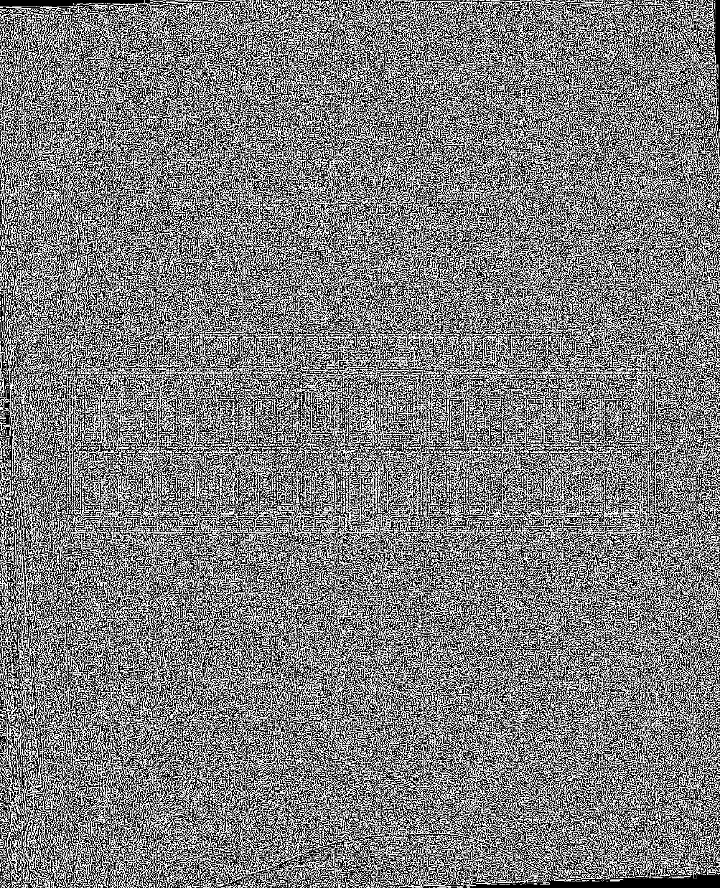
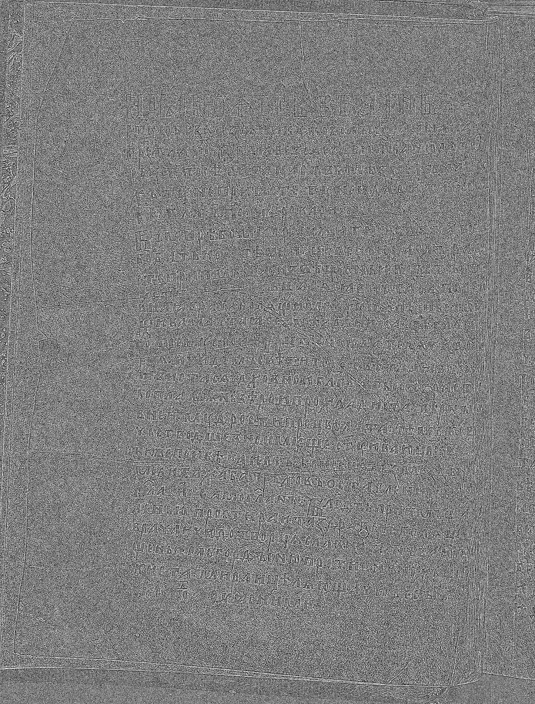
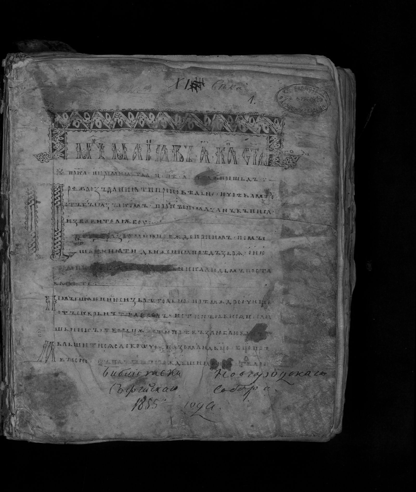
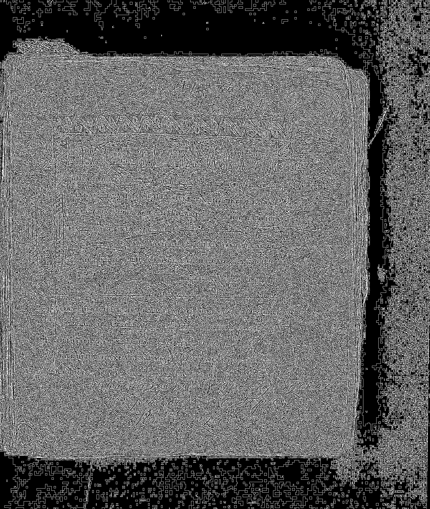
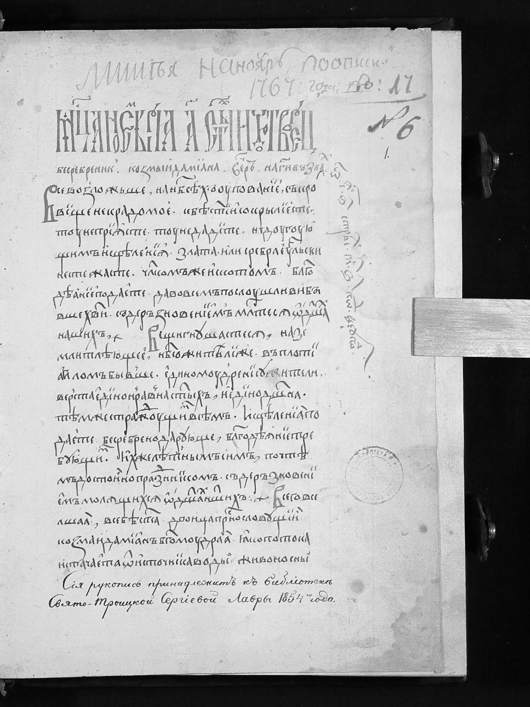
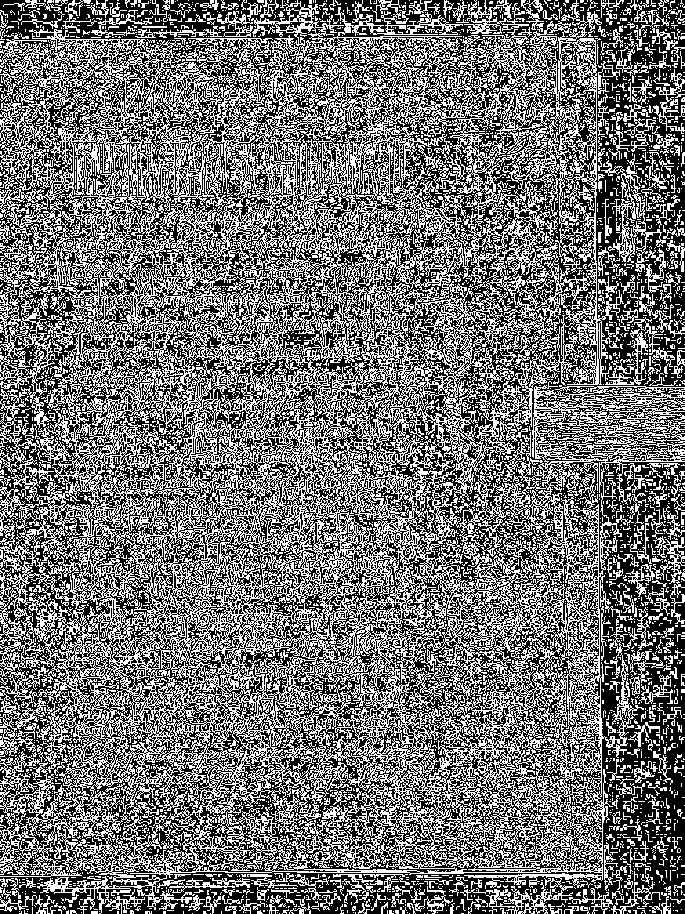
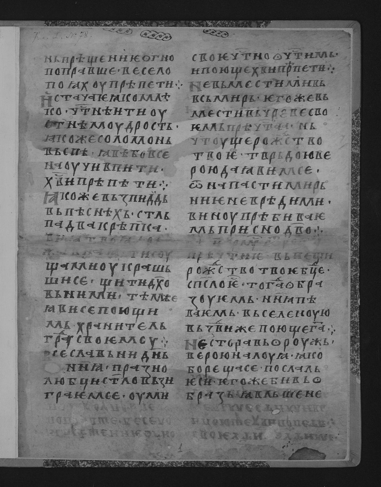
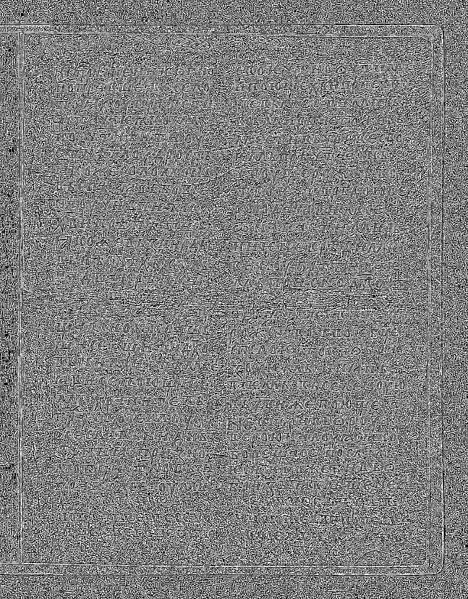
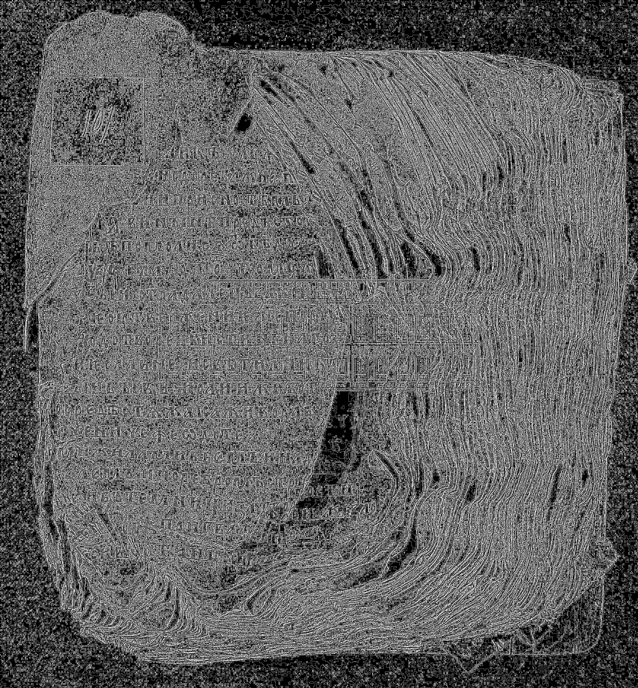
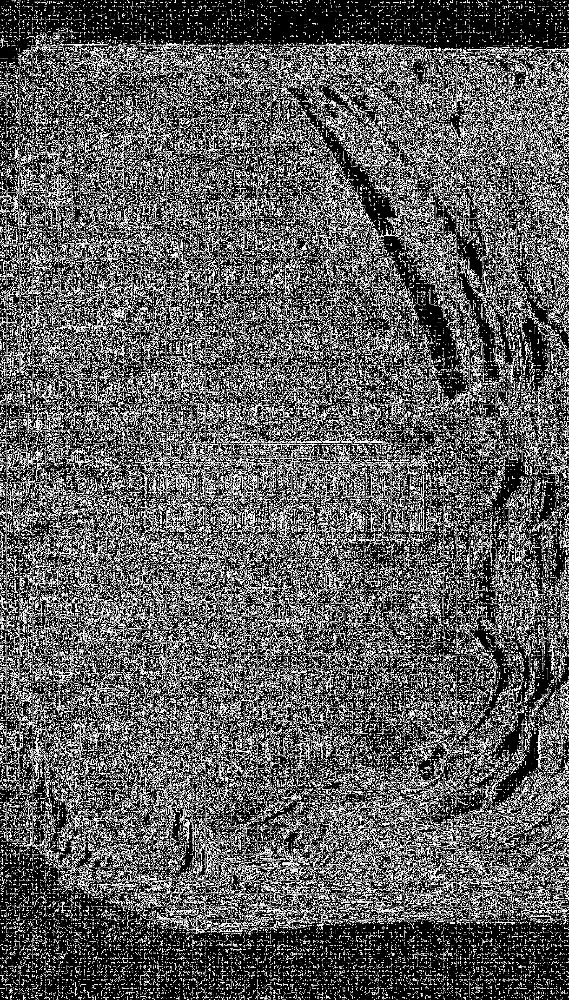

# Отчёт по лабораторной работе №2
## Обесцвечивание и бинаризация растровых изображений (вариант 3)

**Исходные изображения:** `./input/*.png`  
**Результаты обработки:** `./output/`  
**Скрипт:** `./lab2_variant3.py`

---

## Цель работы
Реализовать:
1. перевод полноцветного изображения в полутоновое;
2. бинаризацию полутонового изображения адаптивным методом (вариант 3: локальное среднее, окно `3x3`).

---

## Используемые методы

### 1. Перевод RGB в полутоновое изображение
Яркость каждого пикселя вычисляется по взвешенной формуле:

`Y = 0.299R + 0.587G + 0.114B`

Результат сохраняется в BMP:

`<имя>_gray.bmp`

### 2. Адаптивная бинаризация (вариант 3)
Для каждого пикселя вычисляется локальный порог в окне `3x3`:

`T(x,y) = mean_3x3(x,y) - offset`

`B(x,y) = 255, если I(x,y) > T(x,y), иначе 0`

В отчёте использован `offset = 0`.  
В скрипте для ускорения расчёта среднего применяется интегральное изображение.

Результат сохраняется как:

`<имя>_bin_v3.png`

Также формируется коллаж:

`<имя>_compare.png` (`исходное | полутоновое | бинарное`)

---

## Исходные данные
Входные файлы:

- `./input/01.png`
- `./input/02.png`
- `./input/03.png`
- `./input/04.png`
- `./input/05.png`
- `./input/06.png`
- `./input/07.png`

---

## Результаты обработки

### Пример 1
**Исходное изображение**  

**Полутоновое изображение**  

**Бинаризация (вариант 3, окно 3x3)**  

**Коллаж до/после**  

### Пример 2
**Исходное изображение**  

**Полутоновое изображение**  

**Бинаризация (вариант 3, окно 3x3)**  

**Коллаж до/после**  

### Пример 3
**Исходное изображение**  

**Полутоновое изображение**  

**Бинаризация (вариант 3, окно 3x3)**  

**Коллаж до/после**  

### Пример 4
**Исходное изображение**  

**Полутоновое изображение**  

**Бинаризация (вариант 3, окно 3x3)**  

**Коллаж до/после**  

### Пример 5
**Исходное изображение**  

**Полутоновое изображение**  

**Бинаризация (вариант 3, окно 3x3)**  

**Коллаж до/после**  

### Пример 6
**Исходное изображение**  

**Полутоновое изображение**  

**Бинаризация (вариант 3, окно 3x3)**  

**Коллаж до/после**  

### Пример 7
**Исходное изображение**  

**Полутоновое изображение**  

**Бинаризация (вариант 3, окно 3x3)**  

**Коллаж до/после**  

---

## Вывод
В лабораторной работе реализованы:

- ручной перевод полноцветного изображения в полутоновое;
- адаптивная бинаризация по локальному среднему в окне `3x3` (вариант 3);
- визуальное сравнение результатов для всех входных изображений.

Практически показано, что локальный порог устойчив к неравномерному освещению и лучше выделяет объекты/текст по сравнению с одним глобальным порогом.

