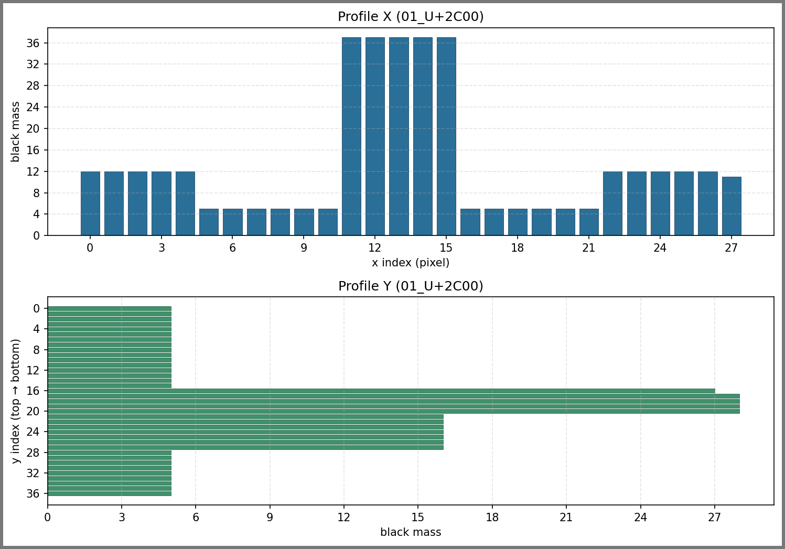
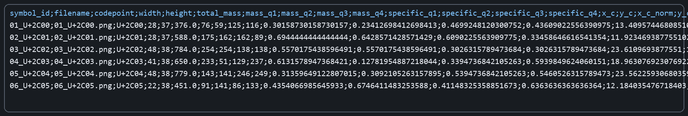

# Лабораторная работа №5 (ОАВИ)
## Вариант 3: Глаголица

### Цель
1. Сформировать эталонные изображения символов алфавита.
2. Для каждого изображения рассчитать набор признаков (a-g).
3. Сохранить скалярные признаки в `*.csv` (разделитель `;`), а профили `X` и `Y` в `*.png`.

### Исходные данные
- Алфавит: глаголица.
- Источник символов: https://symbl.cc/ru/alphabets/glagolitic/
- Количество символов: 43.

### Этап 1. Эталонные изображения
1. Определён набор из 43 букв глаголицы в порядке со страницы варианта.
2. Сгенерированы PNG-изображения каждого символа с обрезкой белых полей.

Параметры:
- Скрипт: `generate_glagolitic_reference.py`
- Шрифт: `Segoe UI Historic` (`seguihis.ttf`)
- Кегль: `52`
- Формат: `PNG`, 1 символ = 1 файл
- Папка результата: `glagolitic_reference_symbols/`

### Этап 2. Выделение признаков
Для всех 43 изображений выполнен расчёт признаков скриптом `extract_symbol_features.py`.

Рассчитаны признаки:
1. Вес (масса чёрного) по четвертям: `mass_q1..mass_q4`.
2. Удельный вес четвертей: `specific_q1..specific_q4`.
3. Координаты центра тяжести: `x_c`, `y_c`.
4. Нормированные координаты центра тяжести: `x_c_norm`, `y_c_norm`.
5. Осевые моменты инерции (горизонталь/вертикаль): `i_x`, `i_y`.
6. Нормированные осевые моменты инерции: `i_x_norm`, `i_y_norm`.
7. Профили `X` и `Y` в виде столбчатых диаграмм `PNG`.

Технические детали:
- Бинаризация: пиксель считается чёрным, если `intensity < 250`.
- Масса чёрного: количество чёрных пикселей (целочисленно).
- Центр тяжести: вычисление по бинарной массе.
- Разделитель в CSV: `;` (точка с запятой).
- Подписи осей на профилях: целочисленные значения.
- Для профиля `Y` используется ориентация `top -> bottom` (как в системе координат изображения).

### Структура результата
- `glagolitic_reference_symbols/*.png` — эталонные символы (43 шт.).
- `glagolitic_reference_symbols/symbols_metadata.csv` — метаданные символов.
- `lab5_features/scalar_features.csv` — скалярные признаки (разделитель `;`).
- `lab5_features/profiles_xy/*.png` — профили `X/Y` для каждого символа (43 шт.).

### Скриншоты результатов
#### 1) Сетка эталонных символов

#### 2) Пример профилей X/Y для одного символа

#### 3) Превью итогового CSV со скалярными признаками

### Проверка
- Эталонных PNG: **43**.
- PNG с профилями: **43**.
- Скалярные признаки сохранены в `lab5_features/scalar_features.csv` с разделителем `;`.
