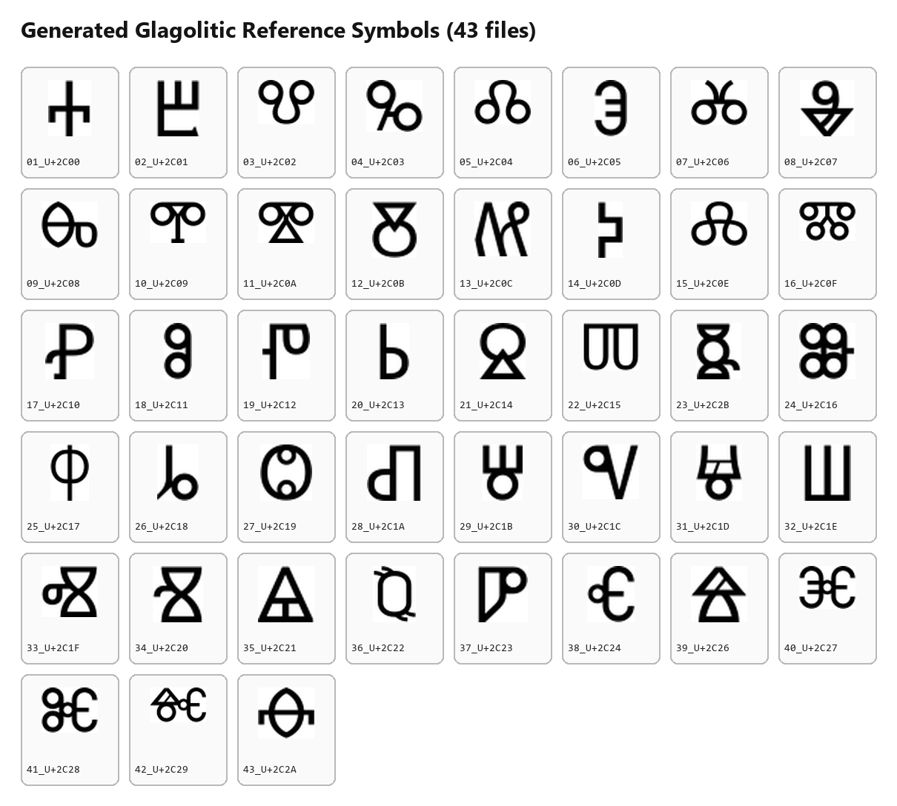
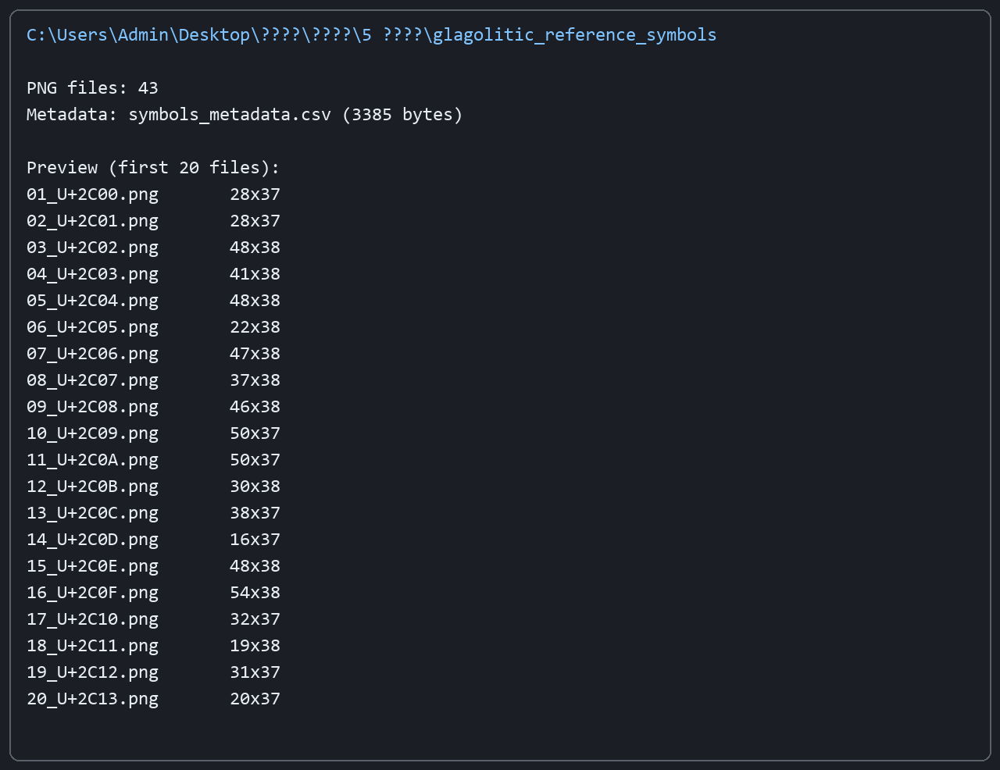

# Лабораторная работа №5 (ОАВИ)
## Вариант 3: Глаголица

### Цель
Сформировать эталонные изображения символов выбранного алфавита по правилу **«1 символ = 1 файл»** с обрезкой белых полей.

### Исходные данные
- Алфавит: глаголица
- Источник символов: https://symbl.cc/ru/alphabets/glagolitic/
- Количество символов: 43

### Что было сделано
1. Определён набор из 43 букв глаголицы в порядке со страницы варианта.
2. Сгенерированы PNG-изображения каждого символа.
3. Выполнена автоматическая обрезка пустых (белых) полей вокруг символа.
4. Добавлен CSV-файл с метаданными (`symbols_metadata.csv`).

### Параметры генерации
- Скрипт: `generate_glagolitic_reference.py`
- Шрифт: `Segoe UI Historic` (`seguihis.ttf`)
- Кегль: `52`
- Формат: `PNG`, 1 символ на файл
- Папка результата: `glagolitic_reference_symbols/`

### Структура результата
- `glagolitic_reference_symbols/*.png` — 43 эталонных изображения символов
- `glagolitic_reference_symbols/symbols_metadata.csv` — индекс, кодпоинт Unicode, имя символа, шрифт, размер

### Скриншоты полученных результатов

#### 1) Сетка сгенерированных символов

#### 2) Снимок содержимого итоговой папки

### Проверка
- Количество PNG-файлов: **43**
- Обрезка белых полей выполнена для каждого символа
