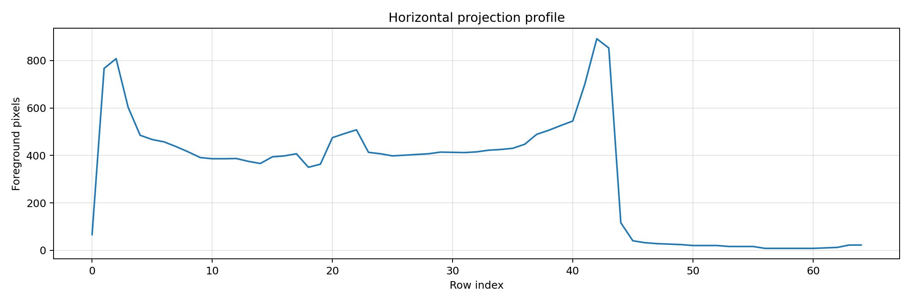
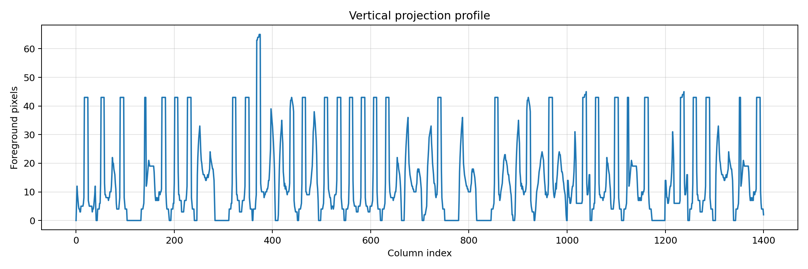
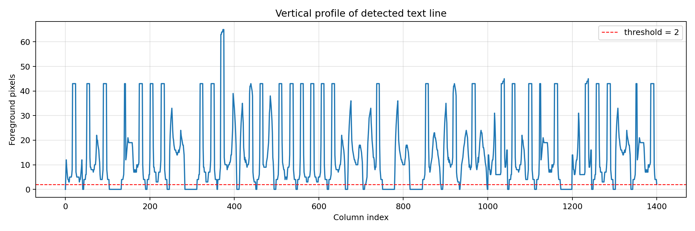
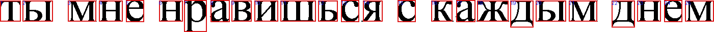
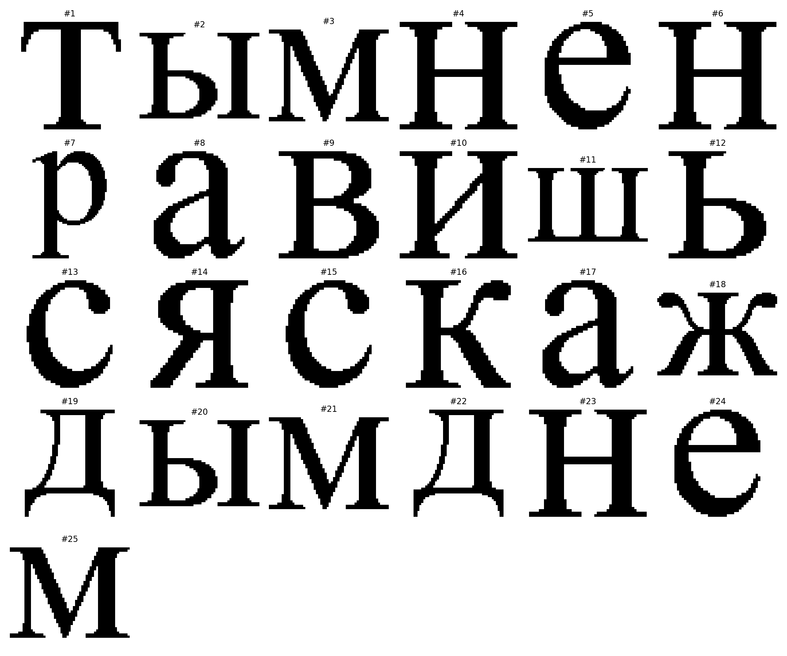
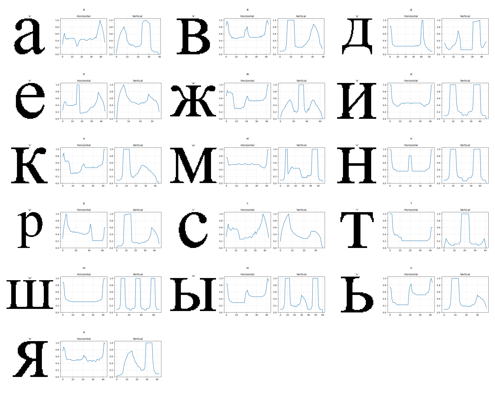

# Лабораторная работа №6 (ОАВИ)
## Сегментация текста

### Цель
Реализовать выделение символов в строке текста по горизонтальному и вертикальному проекционным профилям.

### Исходные параметры
- Фраза: `ты мне нравишься с каждым днем`
- Шрифт: `Times New Roman` (`C:/Windows/Fonts/times.ttf`)
- Размер шрифта: `96 px`
- Бинаризация: `I(x,y)=1` для черного пикселя, `0` для фона
- Параметры сегментации:
- `MAX_INK_IN_GAP = 2` (допуск по вертикальному профилю для разрыва)
- `MIN_GAP_WIDTH = 2` (прореживание: минимальная ширина разрыва)
- `MIN_CHAR_WIDTH = 5` (минимальная ширина символа)

### 1. Подготовка монохромного изображения (`*.bmp`)
Фраза сгенерирована выбранным шрифтом, затем обрезана по границам текста и сохранена в 1-битный BMP без лишнего белого фона.


Файл BMP: `output/source/03_phrase_mono.bmp`

### 2. Горизонтальный и вертикальный профили
Использованы профили:
- Горизонтальный: `H(y)=Σ_x I(x,y)`
- Вертикальный: `V(x)=Σ_y I(x,y)`





### 3. Сегментация символов по профилям с прореживанием
Алгоритм:
- По `H(y)` выделяется строка текста.
- По `V(x)` ищутся столбцы-разделители (`V(x) <= 2`).
- Прореживание: удаляются слишком узкие разрывы (меньше 2 пикселей).
- Непрерывные области между разрывами считаются символами.
- Для каждой области формируется ограничивающий прямоугольник `[x1, y1, x2, y2]`.

Результат: обнаружено `25` символов.




Координаты найденных прямоугольников:

```text
[[0, 1, 41, 44], [44, 1, 104, 44], [133, 1, 189, 44], [194, 1, 241, 44],
 [247, 0, 283, 45], [312, 1, 359, 44], [361, 0, 406, 65], [413, 0, 451, 45],
 [454, 1, 494, 44], [499, 1, 546, 44], [550, 1, 620, 44], [624, 1, 663, 44],
 [669, 0, 705, 45], [712, 1, 751, 44], [780, 0, 816, 45], [846, 1, 888, 44],
 [895, 0, 933, 45], [936, 1, 998, 44], [1001, 1, 1047, 56], [1051, 1, 1111, 44],
 [1116, 1, 1172, 44], [1200, 1, 1246, 56], [1250, 1, 1297, 44], [1303, 0, 1339, 45],
 [1344, 1, 1401, 44]]
```

### 4. Профили символов выбранного алфавита
Выбранный алфавит: уникальные буквы фразы (`16` символов):
`авдежикмнрстшыья`

Для каждого символа построены нормированные горизонтальный и вертикальный профили.



Все отдельные профили сохранены в: `output/alphabet_profiles/profile_*.png`

### Файлы проекта
- Скрипт: `lab6_text_segmentation.py`
- Итоговые данные: `output/results.json`

### Запуск
```powershell
py -3.13 lab6_text_segmentation.py
```
