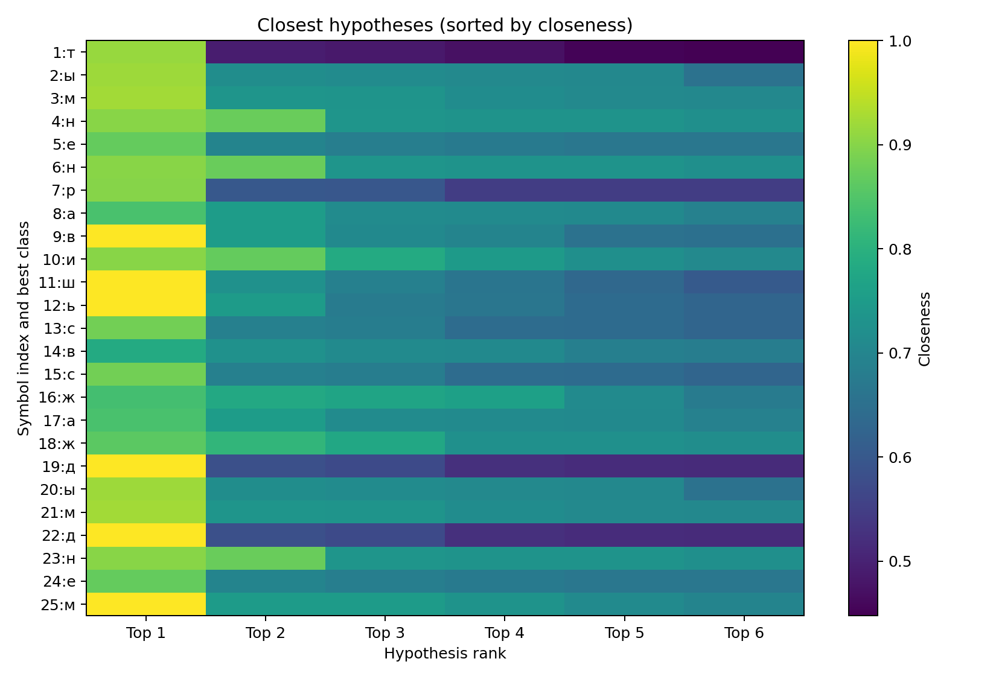
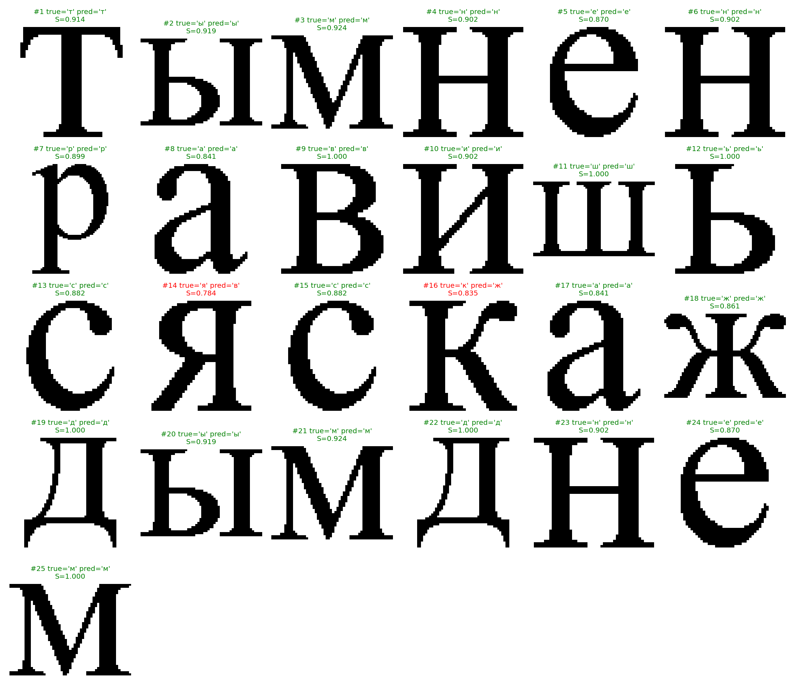
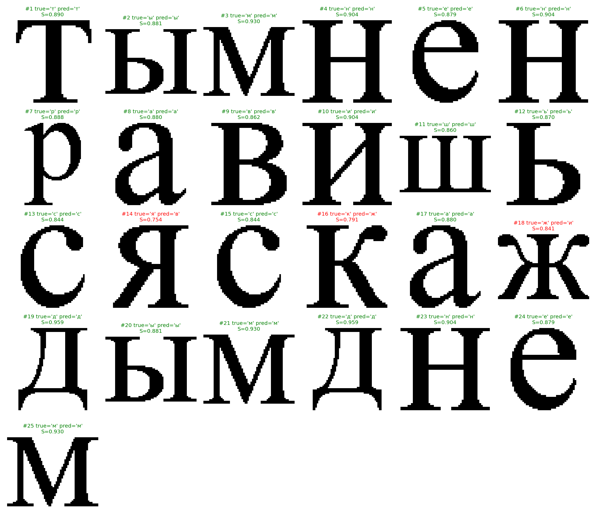
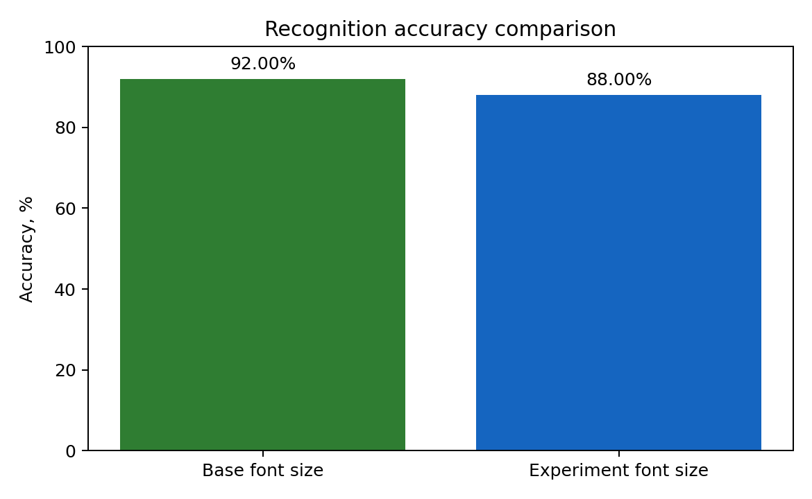

# Лабораторная работа №7 (ОАВИ)
## Классификация на основе признаков, анализ профилей

### Цель
Реализовать посимвольную классификацию сегментированной текстовой строки по признакам и оценить точность распознавания, включая эксперимент при изменении размера шрифта.

### Исходные данные
- Фраза: `ты мне нравишься с каждым днем`
- Шрифт: `Times New Roman` (`C:/Windows/Fonts/times.ttf`)
- Базовый размер шрифта: `96`
- Размер в эксперименте: `104` (увеличение на `+8`)
- Признаки: `mass_norm`, `center_x`, `center_y`, `mu20`, `mu02`
- Мера близости: `S = 1 / (1 + d)`, где `d` — евклидово расстояние в пространстве нормализованных признаков
- Алфавит (16 символов): `авдежикмнрстшыья`

### 1. Расчёт меры близости
Для каждого символа вычислялся вектор признаков:
- нормированная масса символа
- координаты центра тяжести
- осевые центральные моменты инерции второго порядка

После нормализации признаков считалось расстояние до каждого эталонного символа алфавита. Чем расстояние меньше, тем выше мера близости `S`.


### 2-3. Гипотезы для каждого символа и вывод в файл
Обнаружено `25` символов (без пробелов). Для каждого символа сформировано `16` гипотез (по числу букв алфавита), гипотезы отсортированы по убыванию близости.

Файл с гипотезами:
- `output/base/base_hypotheses.txt`

Первые строки файла:
```text
1: [('т', 0.9141), ('к', 0.4920), ('ж', 0.4856), ('я', 0.4731), ('н', 0.4522), ('ш', 0.4475), ('д', 0.4464), ('и', 0.4459), ('р', 0.4283), ('м', 0.4253), ('с', 0.4211), ('а', 0.4172), ('в', 0.4070), ('ы', 0.4044), ('е', 0.4024), ('ь', 0.3931)]
2: [('ы', 0.9189), ('н', 0.7184), ('е', 0.7145), ('и', 0.7086), ('м', 0.7047), ('ш', 0.6558), ('а', 0.6549), ('в', 0.6511), ('ь', 0.6469), ('с', 0.6123), ('ж', 0.6117), ('к', 0.5571), ('я', 0.5510), ('д', 0.5105), ('р', 0.5054), ('т', 0.3890)]
3: [('м', 0.9237), ('е', 0.7351), ('и', 0.7341), ('н', 0.7168), ('ы', 0.7081), ('в', 0.7056), ('а', 0.6600), ('ж', 0.6292), ('я', 0.6214), ('ь', 0.6088), ('р', 0.5930), ('д', 0.5804), ('ш', 0.5790), ('с', 0.5581), ('к', 0.5495), ('т', 0.4070)]
```




### 4. Лучшие гипотезы (первый столбец)
Сформирована строка из top-1 гипотез (без пробелов):
- Получено: `тымненравишьсвсжаждымднем`
- Эталон: `тымненравишьсяскаждымднем`

Ошибки:
- позиция 14: ожидалось `я`, распознано `в`
- позиция 16: ожидалось `к`, распознано `ж`



### 5. Количество ошибок и процент верного распознавания
Базовый случай (`96`):
- Всего символов: `25`
- Ошибок: `2`
- Верно распознано: `92.0%`

### 6. Эксперимент с другим размером шрифта
Распознавание выполнено для строки, сгенерированной размером `104`.

Top-1 строка (без пробелов):
- Получено: `тымненравишьсвсжаидымднем`
- Эталон: `тымненравишьсяскаждымднем`

Ошибки:
- позиция 14: ожидалось `я`, распознано `в`
- позиция 16: ожидалось `к`, распознано `ж`
- позиция 18: ожидалось `ж`, распознано `и`

Метрики эксперимента:
- Всего символов: `25`
- Ошибок: `3`
- Верно распознано: `88.0%`





### Вывод
Классификация по выбранным геометрическим признакам работает устойчиво для исходного шрифта (`92%`), но при изменении размера шрифта точность снижается (`88%`). Основные ошибки наблюдаются между визуально близкими символами.

### Файлы
- Скрипт: `lab7_symbol_classification.py`
- Сводные результаты: `output/summary.json`
- Базовый режим: `output/base/base_results.json`
- Эксперимент: `output/experiment/experiment_results.json`

### Запуск
```powershell
py -3.13 lab7_symbol_classification.py
```
