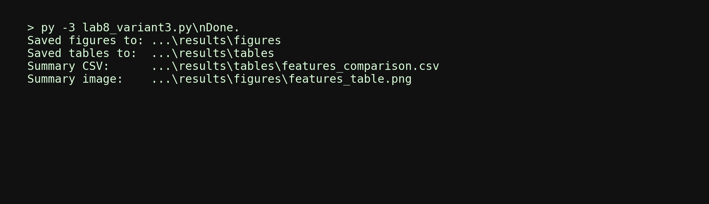
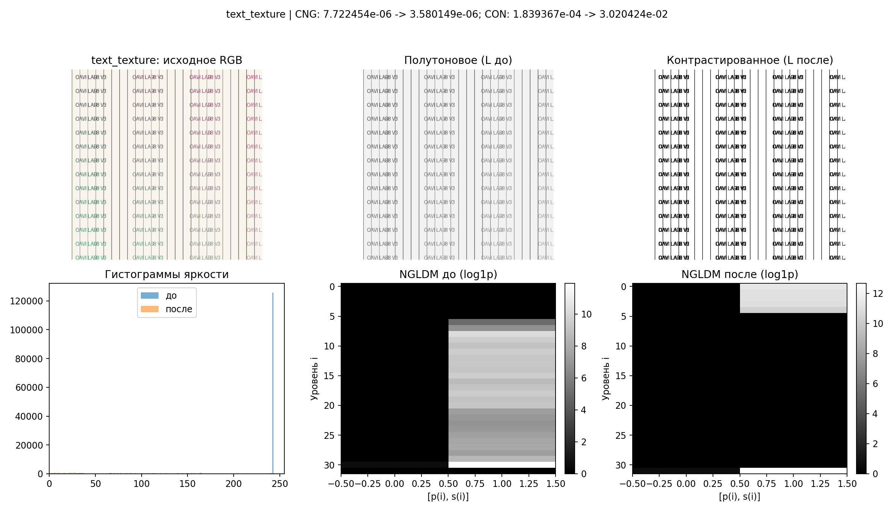
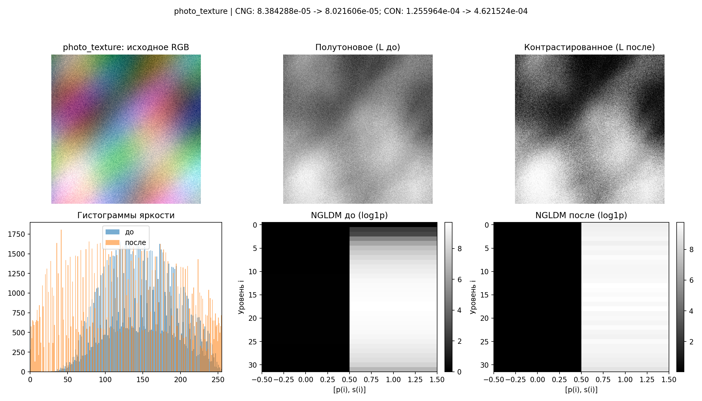
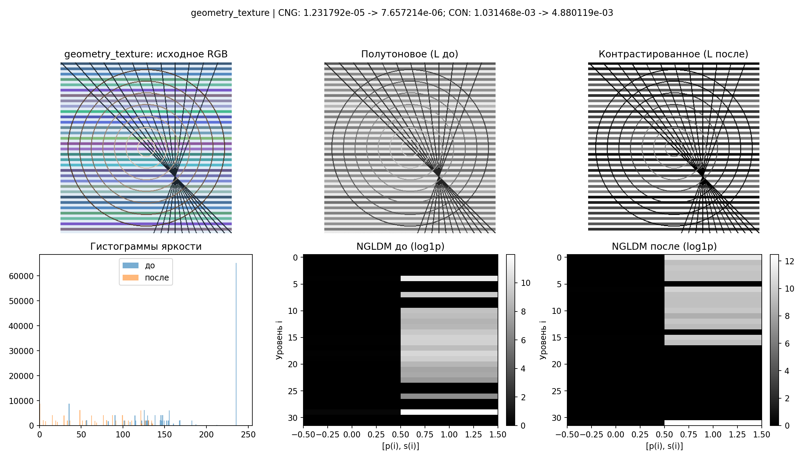
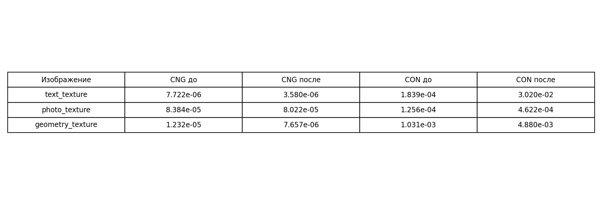

# Лабораторная работа №8 (ОАВИ)
## Вариант 3: NGLDM (`d = 1`), признаки `CNG`, `CON`, метод контрастирования — выравнивание гистограммы

**Дата выполнения:** 24.05.2026  
**Исполнитель:** студент группы ОАВИ

## Цель работы
Выполнить текстурный анализ изображений методом NGLDM, применить контрастирование по яркостному каналу и сравнить текстурные признаки до и после преобразования.

## Постановка (вариант 3)
- Матрица: `NGLDM`
- Параметр: `d = 1`
- Рассчитываемые признаки: `CNG`, `CON`
- Метод преобразования яркости: **выравнивание гистограммы**

## Что сделано
1. Подготовлены 3 разных изображения (текстура текста, фото-подобная текстура, геометрическая текстура).
2. Выполнен перевод RGB в HSL и выделен канал яркости `L`.
3. Для `L` рассчитана NGLDM и признаки `CNG`, `CON`.
4. К `L` применено выравнивание гистограммы.
5. Повторно рассчитаны NGLDM и признаки для контрастированных изображений.
6. Построены и сохранены:
   - исходные/полутоновые/контрастированные изображения;
   - гистограммы яркости до и после;
   - матрицы NGLDM до и после;
   - сводная таблица признаков.

## Формулы
Использована реализация NGLDM (по схеме Amadasun/King, 2D, 8-соседей, `d=1`):
- `NGLDM(i,1) = p(i)` — вероятность уровня серого `i`;
- `NGLDM(i,2) = s(i)` — суммарное локальное отличие уровня `i` от среднего по соседям.

Признаки:
- `CNG = 1 / (sum_i p(i) * s(i) + eps)`
- `CON = [sum_i sum_j p(i)p(j)(i-j)^2 / (G_p(G_p-1))] * [sum_i s(i) / (E*G*(G-1))]`

где `E` — число анализируемых пикселей, `G` — число уровней квантования, `G_p` — число уровней с ненулевой вероятностью.

## Скриншот запуска

## Результаты по изображениям

### 1) `text_texture`

### 2) `photo_texture`

### 3) `geometry_texture`

## Сводная таблица признаков

| Изображение | CNG (до) | CNG (после) | CON (до) | CON (после) |
|---|---:|---:|---:|---:|
| text_texture | 7.722454e-06 | 3.580149e-06 | 1.839367e-04 | 3.020424e-02 |
| photo_texture | 8.384288e-05 | 8.021606e-05 | 1.255964e-04 | 4.621524e-04 |
| geometry_texture | 1.231792e-05 | 7.657214e-06 | 1.031468e-03 | 4.880119e-03 |

## Файлы результата
- Основной скрипт: `lab8_variant3.py`
- Отчёт: `REPORT.md`
- Графики: `results/figures/`
- Матрицы и CSV: `results/tables/`

## Вывод
Выравнивание гистограммы в канале яркости `L` повысило контрастность по признаку `CON` на всех тестовых изображениях (наиболее заметно для `text_texture`). Показатель `CNG` после преобразования в большинстве случаев уменьшился, что соответствует росту локальных яркостных перепадов и более выраженной текстуре.
