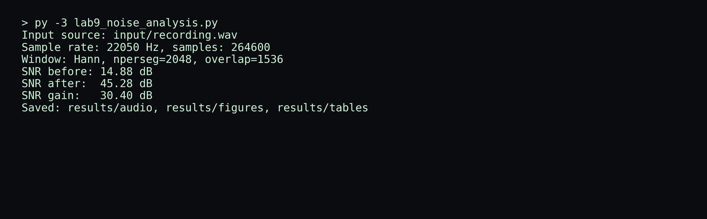
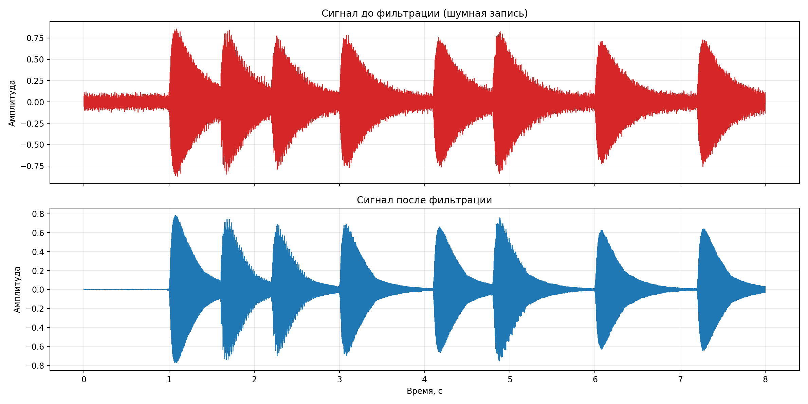
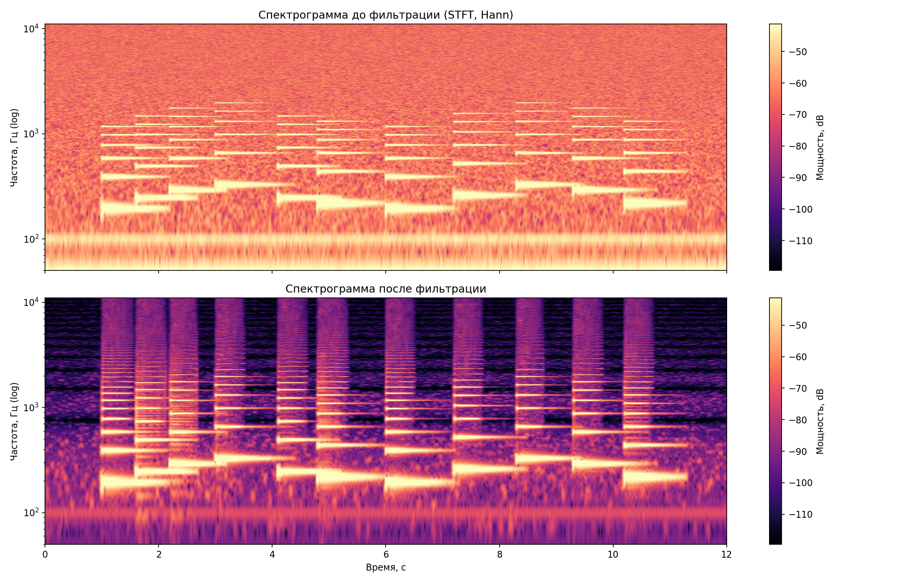
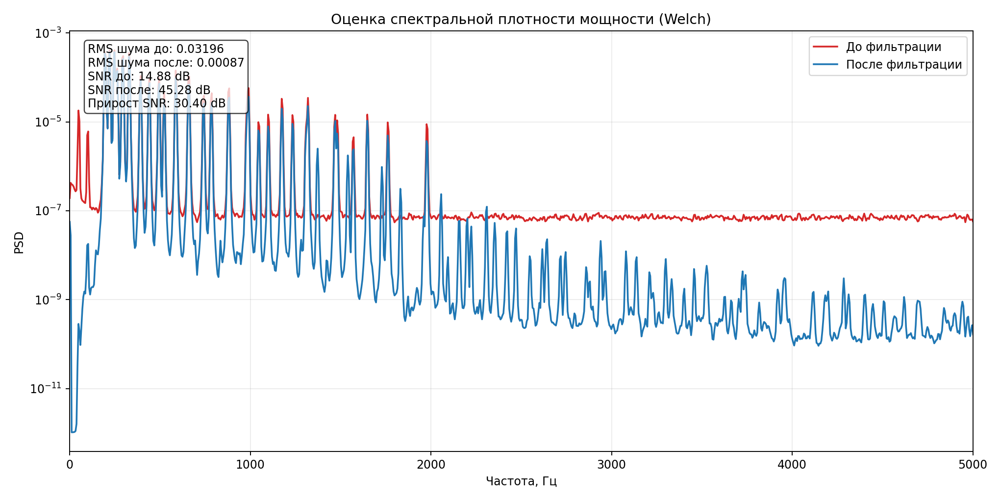
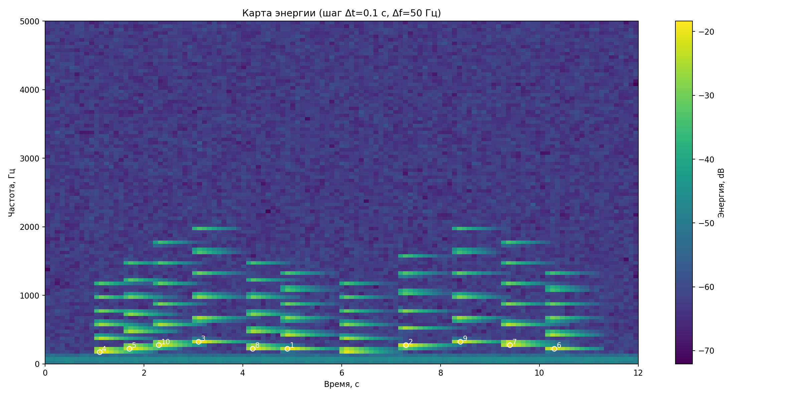

# Лабораторная работа №9 (ОАВИ)
## Анализ шума аудиосигнала

## Цель работы
1. Получить моно-аудиозапись в формате `wav`.
2. Построить спектрограмму с оконным преобразованием Фурье (окно Ханна) и логарифмической шкалой частот.
3. Оценить уровень шума, выполнить шумоподавление и сравнить спектрограммы до/после.
4. Найти моменты времени с максимальной энергией при шагах `Δt = 0.1 c`, `Δf = 50 Гц`.

## Использованное ПО и библиотеки
- Python 3
- `numpy`
- `scipy` (`stft`, `istft`, `wiener`, `welch`, фильтры)
- `matplotlib`
- `scipy.io.wavfile` для чтения/записи `wav`

## Выполнение задания

### 1. Подготовка входного сигнала (`wav`)
Скрипт проверяет файл `input/recording.wav`.
- Если файл есть, используется он.
- Если файла нет, автоматически генерируется тестовая моно-запись инструмента с шумом (для демонстрации лабораторного алгоритма).

В текущем запуске использован файл `input/recording.wav` (моно).  
Если файла нет, скрипт создает его автоматически как тестовую запись инструмента с шумом.

Параметры использованного сигнала:
- Частота дискретизации: `22050 Гц`
- Длительность: `12 с`
- Каналы: `1 (mono)`

### 2. Спектрограмма (STFT, окно Ханна)
Параметры STFT:
- Окно: `Hann`
- `nperseg = 2048`
- `overlap = 1536`
- Отображение частоты: логарифмическая шкала

### 3. Оценка и подавление шума
Для оценки шума использован начальный фрагмент `0.8 с` как шумовой эталон.  
Шумоподавление выполнено комбинацией:
- спектрального вычитания (по шумовому профилю),
- фильтра Винера,
- ВЧ-фильтра (high-pass, 70 Гц) для подавления низкочастотного фона.

Численные результаты:
- `RMS шума до`: `0.03197`
- `RMS шума после`: `0.00087`
- `SNR до`: `14.88 dB`
- `SNR после`: `45.28 dB`
- `Прирост SNR`: `30.40 dB`
- `Снижение шума`: `31.35 dB`

### 4. Максимумы энергии (Δt=0.1 c, Δf=50 Гц)
Построена карта энергии в ячейках времени/частоты и выбраны 10 наибольших локальных максимумов.

Топ-10 событий:

| № | t_start, c | t_center, c | t_end, c | f_from, Гц | f_to, Гц | Energy, dB |
|---|---:|---:|---:|---:|---:|---:|
| 1 | 4.850 | 4.900 | 4.950 | 200 | 250 | -18.38 |
| 2 | 7.250 | 7.300 | 7.350 | 250 | 300 | -18.51 |
| 3 | 3.050 | 3.100 | 3.150 | 300 | 350 | -18.75 |
| 4 | 1.050 | 1.100 | 1.150 | 150 | 200 | -19.10 |
| 5 | 1.650 | 1.700 | 1.750 | 200 | 250 | -19.28 |
| 6 | 10.250 | 10.300 | 10.350 | 200 | 250 | -19.38 |
| 7 | 9.350 | 9.400 | 9.450 | 250 | 300 | -19.51 |
| 8 | 4.150 | 4.200 | 4.250 | 200 | 250 | -19.84 |
| 9 | 8.350 | 8.400 | 8.450 | 300 | 350 | -19.84 |
| 10 | 2.250 | 2.300 | 2.350 | 250 | 300 | -20.47 |

## Скриншоты проделанной работы

### Запуск скрипта

### Осциллограммы до/после фильтрации

### Спектрограммы до/после фильтрации

### PSD и метрики шума

### Карта энергии и отмеченные максимумы

## Структура результатов
- Скрипт: `lab9_noise_analysis.py`
- Отчёт: `REPORT.md`
- Аудио:
  - `results/audio/recording_mono.wav`
  - `results/audio/recording_denoised.wav`
  - `results/audio/clean_reference.wav` (если запись сгенерирована)
- Таблицы:
  - `results/tables/noise_metrics.csv`
  - `results/tables/top_energy_events.csv`
- Графики:
  - `results/figures/*.png`

## Вывод
Построение STFT-спектрограмм и комбинированная фильтрация (спектральное вычитание + Wiener + high-pass) позволили существенно уменьшить шумовой фон и увеличить отношение сигнал/шум. По карте энергии с параметрами `Δt = 0.1 c`, `Δf = 50 Гц` выделены интервалы времени и частотные полосы с наибольшей энергетикой сигнала.
